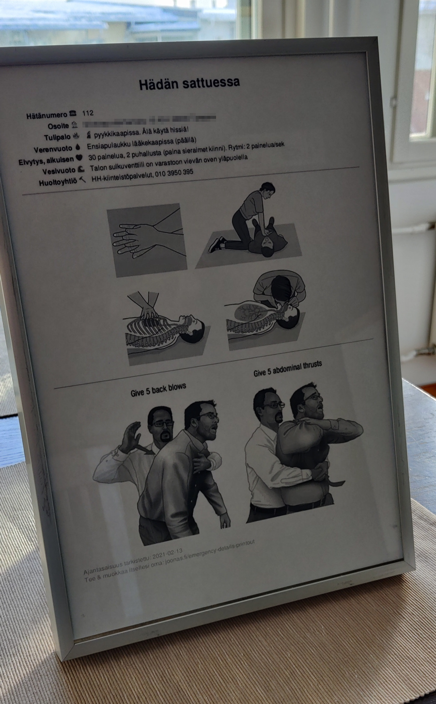

[Website](https://joonas.fi/emergency-details-printout/) for printing an "emergency details" paper
for helping deal with situations that need quick attention.

[20-sec video introduction](https://github.com/joonas-fi/emergency-details-printout/issues/1)

NOTE: Mine is in Finnish, but English and other languages available.

Contribute translations
-----------------------

[Instructions are here](https://github.com/joonas-fi/emergency-details-printout/blob/master/cmd/emergency-details-printout/translations.go#L24)
